# Object-Oriented Programming (OOP)

# 📑 Table of Contents
- [What Is OOP?](#what-is-oop)
- [Objects and Classes](#objects-and-classes)
- [Encapsulation](#encapsulation)
- [Object Relationships](#object-relationships)
- [Inheritance](#inheritance)
- [Polymorphism](#polymorphism--one-action-many-forms)
- [Abstraction](#abstraction--hiding-complexity)

---

# What Is OOP?

**Object-Oriented Programming (OOP)** is a programming style where you organize your code around **objects** — each one bundling its own **data** and **behavior** together.

Instead of one long list of instructions, your program becomes a collection of self-contained pieces that each handle their own responsibilities.

---

## Think in Objects, Not Steps

Before writing any code — let's change how we **think**.

Without OOP, a program feels like a recipe — a fixed list of steps executed from top to bottom:

> “Get input → process it → print the result”

This works fine for small, simple tasks. But as a system grows — more features, more data, more logic — a flat list of steps becomes impossible to manage. Everything is tangled together, and changing one thing risks breaking another.

OOP asks a different question entirely:

> **”What are the THINGS in this system — and what does each one know and do?”**

Instead of one long script, you break the system into **independent, self-responsible pieces**.
Each piece manages its own data and handles its own behavior — just like in the real world.

Think about how a **hospital** actually works.
No single person does everything. Instead:
- A **Doctor** examines patients and writes prescriptions
- A **Nurse** monitors vitals and administers medication
- A **Patient** has a medical history and an appointment schedule
- A **Pharmacy** manages medicine stock and fills prescriptions

Each role knows its own responsibilities. They cooperate — but none of them does another's job.

---

Think about a **food ordering app**.
No single block of code handles everything. Instead:
- A **User** has a profile, address, and order history — and can browse, place orders, and make payments
- A **Restaurant** has a menu, rating, and opening hours — and can accept or reject orders
- An **Order** has items, a total, and a delivery status — and can be confirmed, tracked, or cancelled
- A **Driver** has a location and availability — and can accept deliveries and update the status

Each part of the system handles its own data and its own logic.
They work together — but each one stays in its own lane.

**OOP models software the same way** — each object is responsible for itself, and objects collaborate to make the system work.

---

## From Real World to Objects

Take a **coffee shop**. Before writing any code, ask three questions:

- What **things** exist here?
- What does each thing **have** (data)?
- What can each thing **do** (behavior)?

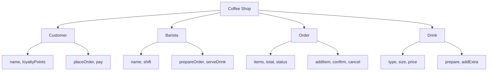

You just mapped out an OOP system — **without writing a single line of code**.

Now compare two ways of thinking about the scenario *”a customer orders a coffee”*:

**Procedural** — focus on steps:
```
1. Take customer name
2. Take order
3. Calculate price
4. Prepare drink
5. Serve and collect payment
```

**OOP** — focus on things and their responsibilities:
```
Customer  → places an Order
Order     → contains a Drink, has a total
Barista   → prepares the Drink
Payment   → processed when Order is confirmed
```

> This is the OOP mindset: **model the world as it is, not as a sequence of steps.**

---

## Why OOP?

As systems grow, OOP keeps everything manageable:

| Benefit | What It Means |
|---|---|
| **Reusability** | Write `Item` once, reuse for Burger, Pizza, Fries |
| **Data protection** | A user cannot tamper with another user's balance |
| **Easy to extend** | Add `Salad` without touching any existing code |
| **Mirrors real life** | Code is structured the way humans naturally think |

---

## Core Principles of OOP

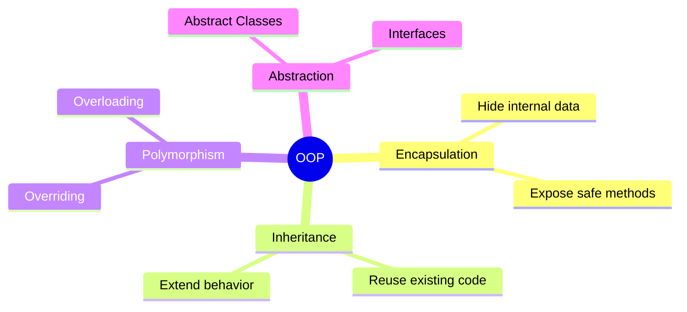

### Encapsulation — Protect Your Data

Each object keeps its data **private** and only allows access through controlled methods.
Think of it like a bank account — you can deposit or withdraw, but you can never directly reach in and change the balance yourself.

> **Hide what's inside. Expose only what's needed.**

---

### Inheritance — Build on What Already Exists

A class can **inherit** fields and methods from another class, so you don't rewrite the same code twice.
Think of it like a job role — a `Manager` is still a `Person`, so it inherits everything a person has, then adds its own responsibilities on top.

> **Don't repeat yourself. Extend what already works.**

---

### Polymorphism — One Interface, Many Behaviors

The same method can behave **differently** depending on which object calls it.
Think of a `pay()` method — paying by card, cash, or voucher all feel the same to the caller, but each works differently under the hood.

> **Same action, different result depending on the object.**

---

### Abstraction — Show What Matters, Hide the Rest

An object exposes **what it does**, not **how it does it**.
Think of driving a car — you press the accelerator and it moves. You don't need to know anything about the engine, fuel injection, or gearbox.

> **Show the interface. Hide the complexity.**

---

Now that we understand the *mindset* — thinking in objects instead of steps — the next question is:

> **How do we actually build objects in code?**

That's where **Classes** and **Objects** come in.

---

## The Blueprint Idea

In the real world, before you build something, you need a **plan**.

- An **architect** draws a blueprint before building a house
- A **car factory** uses a design template before manufacturing cars
- A **cookie cutter** defines the shape before you stamp out cookies

The blueprint itself is **not** the final thing — it's just the template.
From one blueprint, you can create **many** real things.

**This is exactly how OOP works:**

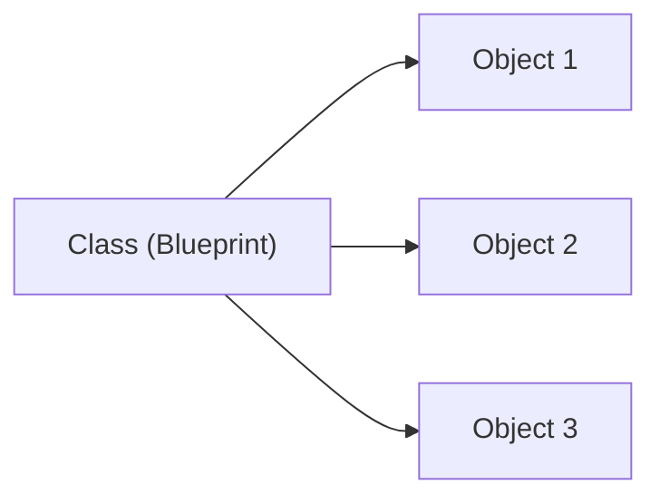

- The **Class** is the blueprint — it defines what an object looks like and what it can do
- The **Object** is the real instance — created from that blueprint, with its own actual data

---

# Objects and Classes

Every object in OOP has two things:

- **Data (State)** — the attributes or characteristics of the object
- **Behavior (Methods)** — the actions the object can perform

## Types of Objects in OOP

Objects can represent **physical** things you can touch, or **logical** concepts that exist only inside a system.

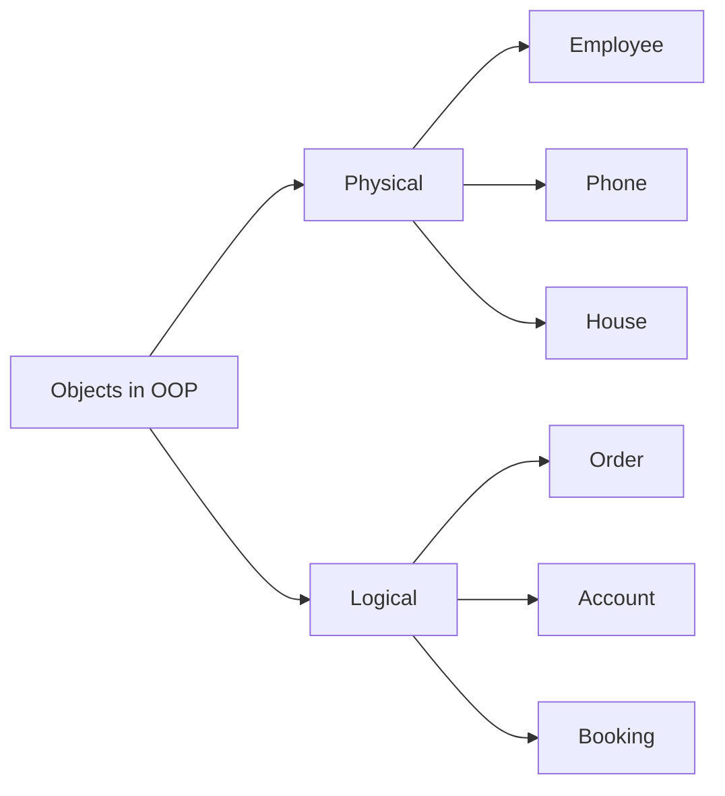

Both types combine **data + behavior** — that's what makes them objects.

---

## Class — The Blueprint

A **class** is a template that defines what an object looks like and what it can do.
It is **not** an object itself — it is the plan used to create objects.

Every class has three parts:

| Part | Purpose | Example |
| --- | --- | --- |
| **Fields** | Store the object's data | `name`, `role`, `salary` |
| **Constructor** | Build and initialize the object | `Employee("Sara", "Developer", 55000)` |
| **Methods** | Define the object's behavior | `introduce()`, `work()` |

```java
public class Employee {
    // fields
    // constructor
    // methods
}
```

## Object — The Instance

An **object** is a real instance created from a class.
If the class is the design, the object is the actual thing you use.

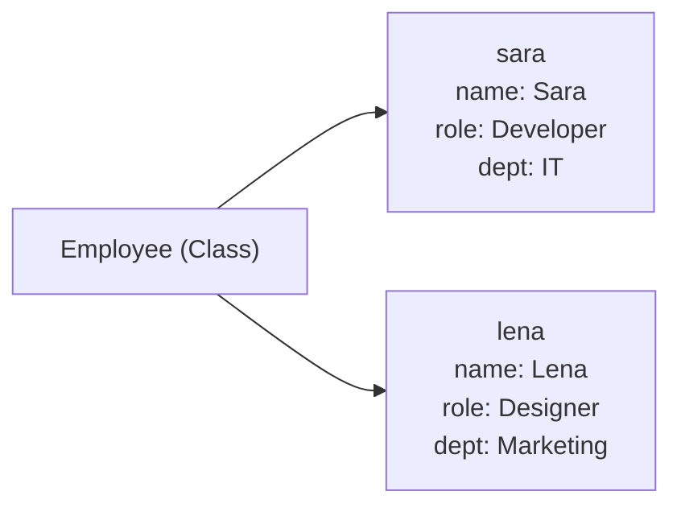

- `Employee` → the class (blueprint)
- `sara`, `lena` → two separate objects, each with their own data

---

## Fields — Object Data

Fields store **data that belongs to each individual object**.
Every object created from the same class has the same fields — but its own values.

```java
public class Employee {
    String name;
    String role;
    String department;
    double salary;
}
```

---

## Methods — Object Behavior

Methods define **what an object can do**.
They are functions that belong to the object and can read or change its data.

```java
public class Employee {
    String name;
    String role;
    String department;
    double salary;

    void introduce() {
        IO.println("Hi, I'm " + name + ", " + role + " in " + department + ".");
    }

    void work() {
        IO.println(name + " is working on their tasks.");
    }

    void raiseSalary(double amount) {
        salary += amount;
        IO.println(name + "'s new salary: " + salary);
    }

    void displayInfo() {
        IO.println(name + " | " + role + " | " + department + " | " + salary);
    }
}
```

```java
public class App {
    void main() {
        Employee anna = new Employee();  
        anna.name = "Anna";
        anna.role = "Developer";
        anna.department = "IT";
        anna.salary = 75000;
        
        Employee lena = new Employee();
        lena.name = "Lena";
        lena.role = "Designer";
        lena.department = "Marketing";
        lena.salary = 65000;
    }
}
```

---

## Constructor — Building the Object

A **constructor** is a special method that runs automatically the moment you write `new`.
Its job: receive the initial values and set every field so the object is **fully ready to use the instant it exists**.

### The Problem — A Half-Built Object

Without a constructor, you create an object first and then fill in fields one by one afterward:

```java
public class App {
    void main() {
        Employee anna = new Employee();   // exists — but every field is null or 0
        anna.name = "Anna";
        anna.role = "Developer";
        anna.department = "IT";
        anna.salary = 75000;
    }
}
```

Between `new` and the last line, `anna` is incomplete.
Skip one assignment and the object silently has a `null` name or a `0` salary — no compile error, no warning.

A constructor solves this — one call and the object is complete:

```java
Employee anna = new Employee("Anna", "Developer", "IT", 75000);
//              ↑ fully built in one step — all four fields set immediately
```

### Understanding `this`

The constructor parameters share names with the fields: `name`, `role`, `department`, `salary`.
Inside the constructor, Java needs to know which `name` you mean — the field on the object or the parameter coming in.

`this` refers to **the object being built right now**:

```java
this.name = name;   // this.name → field on the object  |  name → parameter passed in
```

Without `this`, Java reads `name = name` — assigns the parameter to itself, and the field is never set.

Here is the constructor added to `Employee`:

```java
public class Employee {
    String name;
    String role;
    String department;
    double salary;

    public Employee(String name, String role, String department, double salary) {
        this.name       = name;
        this.role       = role;
        this.department = department;
        this.salary     = salary;
    }

    void introduce() {
       IO.println("Hi, I'm " + name + ", " + role + " in " + department + ".");
    }

    void work() {
       IO.println(name + " is working on their tasks.");
    }

    void raiseSalary(double amount) {
        salary += amount;
       IO.println(name + "'s new salary: " + salary);
    }

    void displayInfo() {
       IO.println(name + " | " + role + " | " + department + " | " + salary);
    }
}
```

Creating objects using the constructor:

```java

public class App {
    
    void main(){
        Employee sara = new Employee("Sara", "Developer", "IT",        75000);
        Employee lena = new Employee("Lena", "Designer",  "MARKETING", 65000);

        sara.introduce();         // Hi, I'm Sara, Developer in IT.
        sara.work();              // Sara is working on their tasks.
        sara.raiseSalary(5000);   // Sara's new salary: 80000.0

        lena.introduce();          // Hi, I'm Lena, Designer in MARKETING.
        lena.displayInfo();        // Lena | Designer | MARKETING | 65000.0
    }
    
}

```

---

## Constructor Overloading

Just like methods, constructors can be **overloaded** — you can have multiple constructors in the same class, each accepting different parameters.

This is useful when you want to create objects with different levels of detail.

```java
public class Employee {
    String name;
    String role;
    String department;
    double salary;

    // Default constructor — no parameters, fields stay at null/0
    public Employee() { }

    // Name-only constructor — useful when only the name is known at creation time
    public Employee(String name) {
        this.name       = name;
        this.role       = "Unassigned";
        this.department = "IT";
        this.salary     = 0;
    }

    // Full constructor — all details provided upfront
    public Employee(String name, String role, String department, double salary) {
        this.name       = name;
        this.role       = role;
        this.department = department;
        this.salary     = salary;
    }

    void introduce() {
       IO.println("Hi, I'm " + name + ", " + role + " in " + department + ".");
    }

    void work() {
       IO.println(name + " is working on their tasks.");
    }

    void raiseSalary(double amount) {
        salary += amount;
       IO.println(name + "'s new salary: " + salary);
    }

    void displayInfo() {
       IO.println(name + " | " + role + " | " + department + " | " + salary);
    }
    
}
```

All three constructors can be used depending on how much information is available:

```java

public class App {
    
    void main() {
        Employee unknown = new Employee();                                            // Default — all fields null/0
        Employee junior = new Employee("Oskar");                                     // Name only
        Employee senior = new Employee("Maja", "Manager", "HR", 90000);             // Full details

        unknown.displayInfo();  // null | null | null | 0.0
        junior.displayInfo();   // Oskar | Unassigned | IT | 0.0
        senior.displayInfo();   // Maja | Manager | HR | 90000.0
    }
    
}
```

| Constructor | Fields set | When to use |
| --- | --- | --- |
| `Employee()` | none | Object created later and filled in manually |
| `Employee(name)` | name, role, department, salary | Only name is known at creation time |
| `Employee(name, role, department, salary)` | all | All details are available upfront |

---

## Static Fields and Methods

Normal fields and methods belong to **each object individually**.
Static fields and methods belong to the **class itself** — shared across all objects.

```java
public class Employee {
    static int totalEmployees = 0;   // shared — belongs to the class

    String name;
    String role;
    String department;
    double salary;

    public Employee(String name, String role, String department, double salary) {
        this.name       = name;
        this.role       = role;
        this.department = department;
        this.salary     = salary;
        totalEmployees++;            // increments every time a new Employee is created
    }

    void introduce() {
       IO.println("Hi, I'm " + name + ", " + role + " in " + department + ".");
    }

    void work() {
       IO.println(name + " is working on their tasks.");
    }

    void raiseSalary(double amount) {
        salary += amount;
       IO.println(name + "'s new salary: " + salary);
    }

    void displayInfo() {
       IO.println(name + " | " + role + " | " + department + " | " + salary);
    }

    static void printTotalEmployees() {
       IO.println("Total employees hired: " + totalEmployees);
    }
}
```

```java

public class App {
    
    void main() {
        Employee anna = new Employee("Anna", "Developer", "IT",        75000);
        Employee lena = new Employee("Lena", "Designer",  "MARKETING", 65000);

        anna.displayInfo();               // Anna | Developer | IT | 75000.0
        lena.displayInfo();               // Lena | Designer | MARKETING | 65000.0

        Employee.printTotalEmployees();   // Total employees hired: 2
    }
    
}

```

> Use `static` when the data or action belongs to the class, not to any specific object.

---

## Enum — Fixed Set of Constants

### The Problem — Strings Are Not Safe

When `department` is a `String`, any value is accepted — valid or not:

```java
Employee e1 = new Employee("Anna", "Developer", "IT",       75000);  // fine
Employee e2 = new Employee("Lena", "Designer",  "it",       65000);  // lowercase — still compiles
Employee e3 = new Employee("Lars", "Analyst",   "FIANANCE", 70000);  // typo — still compiles
Employee e4 = new Employee("Maja", "Manager",   "MOONBASE", 90000);  // invented — still compiles
```

All four compile and run without error.
The bugs only surface later — in a report, a comparison, a filter — by which point the data is silently broken.

### The Solution — Enum

An **enum** defines a **closed, fixed list** of named constants.
Only the values on the list exist — anything else is a compile error.

```java
public enum Department {
    IT, HR, FINANCE, MARKETING
}
```

```java
public class Employee {
    static int totalEmployees = 0;

    String     name;
    String     role;
    Department department;
    double     salary;

    public Employee(String name, String role, Department department, double salary) {
        this.name       = name;
        this.role       = role;
        this.department = department;
        this.salary     = salary;
        totalEmployees++;
    }

    void introduce() {
       IO.println("Hi, I'm " + name + ", " + role + " in " + department + ".");
    }

    void work() {
       IO.println(name + " is working on their tasks.");
    }

    void raiseSalary(double amount) {
        salary += amount;
       IO.println(name + "'s new salary: " + salary);
    }

    void displayInfo() {
       IO.println(name + " | " + role + " | " + department + " | " + salary);
    }

    static void printTotalEmployees() {
       IO.println("Total employees hired: " + totalEmployees);
    }
}
```

```java
public class App {
    
    void main(){
        Employee devEmp = new Employee("Linnea", "Developer", Department.IT,      80000);
        Employee finEmp = new Employee("Lars",   "Analyst",   Department.FINANCE, 70000);

        devEmp.displayInfo();   // Linnea | Developer | IT | 80000.0
        finEmp.displayInfo();   // Lars | Analyst | FINANCE | 70000.0

        devEmp.introduce();     // Hi, I'm Linnea, Developer in IT.
        finEmp.work();          // Lars is working on their tasks.

        Employee.printTotalEmployees();   // Total employees hired: 2
    }
    
}

```
### String vs Enum

| | `String` | `enum` |
|---|---|---|
| Typo in value | Compiles — silent bug | Compile error immediately |
| Invalid value | Any text accepted — no error | Must be on the list — or compile error |
| IDE autocomplete | No | Yes — all valid values listed |
| Comparing values | Case-sensitive, fragile | Safe — `dept == Department.IT` |

> Use an enum any time a field has a fixed, known set of values — status, category, type, role.
> Never represent these with a plain `String`.

---

## Class Diagram

A **class diagram** is a blueprint of your system that you draw *before* writing any code.

It answers four questions in one picture:
- **What exists?** — every class, abstract class, interface, and enum in the system
- **What does each class hold?** — its fields and their types
- **What can each class do?** — its methods and constructors
- **How do classes connect?** — inheritance, composition, aggregation, association

You can hand a class diagram to any developer on your team and they will understand the structure of the system without opening a single file.

> Think of it like an architect's blueprint. The plan is drawn *before* laying a single brick — not to describe what's already built, but to **think through the design while changes are still cheap**.

### Why Draw It First?

In code, design mistakes are expensive: renaming a class, splitting a responsibility, or reversing a relationship all take time and risk breaking things.

A class diagram lets you make those mistakes on paper:
- Spot a missing class before spending hours coding the wrong one
- Catch a broken relationship before it becomes wrong code
- Agree on structure with your team before anyone diverges

### When to Use a Class Diagram

| Situation | What it prevents |
|---|---|
| Starting a new feature | Writing code in the wrong direction |
| Working in a team | Everyone building a different mental model |
| Reviewing existing code | Spending an hour reading files just to understand structure |
| Explaining a system | Replacing a wall of code with one clear picture |

### Reading a Class Box

Every class is a box with three sections — name at the top, fields in the middle, methods at the bottom:

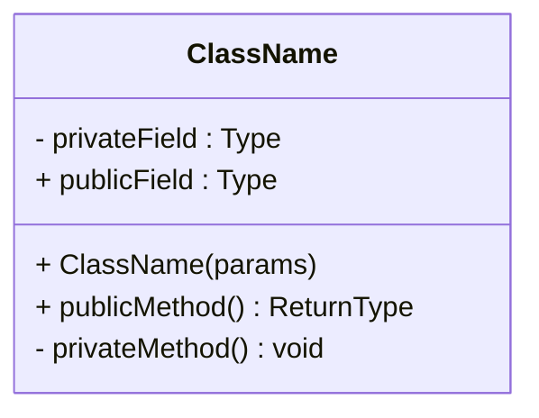

### Visibility Symbols

| Symbol | Java keyword | Meaning |
|---|---|---|
| `+` | `public` | accessible from anywhere |
| `-` | `private` | accessible only inside this class |
| `#` | `protected` | this class and all its subclasses |
| `~` | *(no keyword)* | package-private — accessible within the same package only |

> In practice, class diagrams almost always use only `+` and `-`.
> `#` and `~` are shown here for completeness — they rarely appear in basic OOP diagrams.

### Class-Level Symbols

| Symbol | Meaning |
|---|---|
| `$` | `static` — belongs to the class, not to any object |
| `*` on a method | `abstract` — no body; every subclass must provide one |
| `<<abstract>>` | the class is abstract — cannot be instantiated directly |
| `<<interface>>` | a pure contract — defines what, not how |
| `<<enumeration>>` | a fixed set of named constants |

### Relationship Arrows

| Arrow | Symbol | Meaning |
|---|---|---|
| Inheritance | `<\|--` | `extends` — "is-a" relationship |
| Implementation | `<\|..` | `implements` — signs the contract |
| Aggregation | `o--` | has-a (weak) — parts survive without the whole |
| Composition | `*--` | owns (strong) — parts cannot exist without the whole |
| Association | `-->` | uses — temporary or method-level connection |
| Dependency | `..>` | depends on — appears in method signatures |

### Multiplicity

**Multiplicity** tells you *how many* of one thing can be connected to *how many* of the other.
It is placed on both ends of a relationship arrow, right next to the class it describes.

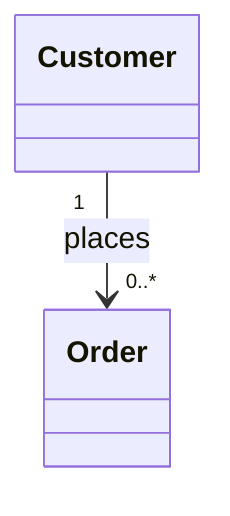

Read this left to right: *one Customer places zero or more Orders.*
Read it right to left: *each Order belongs to exactly one Customer.*

| Notation | Meaning | Example in plain language |
|---|---|---|
| `1` | exactly one | every Order belongs to exactly one Customer |
| `0..1` | zero or one | an Order may or may not have a Payment |
| `1..*` | one or more | a Restaurant has at least one MenuItem |
| `0..*` | zero or more | a Customer may have placed no orders yet |

**Why multiplicity matters:**
Without it, a relationship arrow only says "these two things are connected." With it, the diagram answers real business questions — *can a customer have multiple orders? can an order exist without a payment?* Every multiplicity value comes from a real rule in the system, not from guessing.

### Example — `Employee` and `Department`

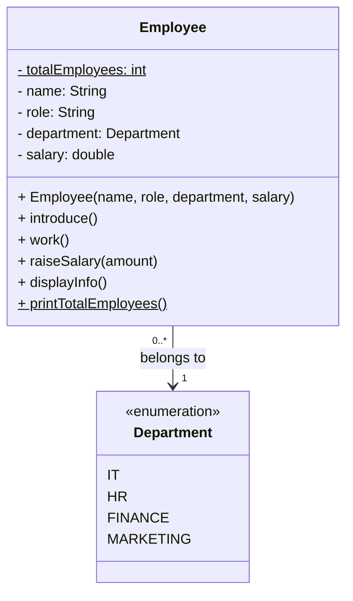

---

# Encapsulation

**Encapsulation** is the practice of keeping an object's data **private** and only allowing access through controlled methods.

The problem it solves: without encapsulation, any code can directly reach into an object and set any value — valid or not. There is nothing stopping someone from setting a negative salary or an empty name. The object has no way to protect itself.

Encapsulation gives the object control over its own data: only valid values get in, and invalid ones are rejected immediately.

---

Think about an **ATM machine**.

You can check your balance, deposit money, or make a withdrawal — but you cannot open the machine and grab the cash directly.
The machine decides what you are allowed to do and enforces rules before any action happens:
- It checks your PIN before letting you in
- It checks your balance before allowing a withdrawal
- It rejects negative amounts and invalid inputs automatically

You never touch the money directly. You go through the **interface** — the buttons on the screen — and the machine handles everything safely on the inside.

**This is exactly what Encapsulation does in code.**

| ATM | Java Object |
| ---- | ---- |
| Cash inside the machine | Private fields |
| Buttons on the screen | Public methods |
| PIN check + balance check | Validation logic in setters |
| Rejects invalid requests | Throws `IllegalArgumentException` |

> **Encapsulation = hide the data, expose only controlled access.**
> The object enforces its own rules — the caller cannot bypass them.

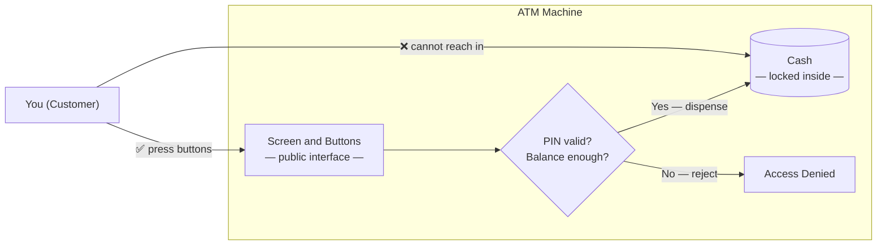

---

## The Problem — Unprotected Fields

Look at the `Employee` class we have been building.
The fields have no access modifier — which means **any code anywhere in the package can read or write them directly**, with no checks and no protection.

```java
public class Employee {
    String name;         // no access modifier — package-visible
    String role;
    Department department;
    double salary;
}
```

Because the fields are wide open, nothing stops this:

```java
void main() {
    Employee anna = new Employee("Anna", "Developer", Department.IT, 75000);

    anna.salary     = -99999;   // negative salary — no error
    anna.name       = "";       // empty name — no error
    anna.department = null;     // null department — no error

    anna.displayInfo();
    // "" | null | -99999.0   ← broken object, Java said nothing
}
```

**Why is this dangerous?**
- The object is now in a corrupt, invalid state
- No exception was thrown — the code ran "successfully"
- Any code that reads `anna.salary` will silently get `-99999`
- The `Employee` class had no way to stop this

> The object cannot defend itself.
> It must trust every caller to do the right thing — and that trust will be broken.

---

## The Solution — Private Fields + Controlled Access

Encapsulation fixes this with two steps.

**Step 1 — Hide the data:** mark every field `private`

```java
public class Employee {
    private String     name;
    private String     role;
    private Department department;
    private double     salary;
}
```

Now `anna.salary = -99999` is a **compile error** — the field is invisible from outside the class.

**Step 2 — Control access:** provide public methods that validate before changing anything

A **getter** gives read-only access. A **setter** validates before writing:

```java
// Getter — read only
public double getSalary() {
    return salary;
}

// Setter — validate before writing
public void setSalary(double salary) {
    if (salary < 0)
        throw new IllegalArgumentException("Salary cannot be negative.");
    this.salary = salary;
}
```

Every field follows the same pattern. Here is the complete encapsulated `Employee` class:

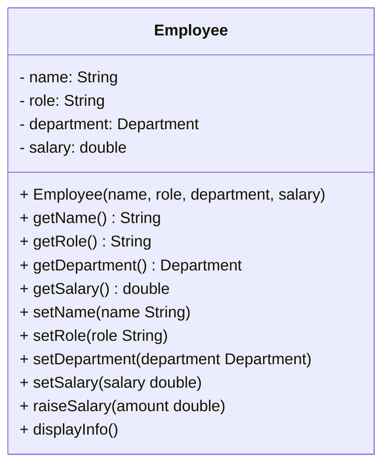

```java
public class Employee {

    // ── FIELDS ────────────────────────────────────────────────────────
    // private = only this class can read or write these directly
    // No outside code can touch them — access goes through methods only
    private String     name;
    private String     role;
    private Department department;
    private double     salary;

    // ── CONSTRUCTOR ───────────────────────────────────────────────────
    // Routes through setters so validation runs even at creation time
    // An Employee can never be created with invalid data
    public Employee(String name, String role, Department department, double salary) {
        setName(name);
        setRole(role);
        setDepartment(department);
        setSalary(salary);
    }

    // ── GETTERS ───────────────────────────────────────────────────────
    // Allow outside code to READ a field — but not change it directly
    public String     getName()       { return name; }
    public String     getRole()       { return role; }
    public Department getDepartment() { return department; }
    public double     getSalary()     { return salary; }

    // ── SETTERS ───────────────────────────────────────────────────────
    // Allow outside code to CHANGE a field — but only after validation
    // Invalid values are rejected with a clear error message

    public void setName(String name) {
        if (name == null || name.isBlank())
            throw new IllegalArgumentException("Name cannot be empty.");
        this.name = name;
    }

    public void setRole(String role) {
        if (role == null || role.isBlank())
            throw new IllegalArgumentException("Role cannot be empty.");
        this.role = role;
    }

    public void setDepartment(Department department) {
        if (department == null)
            throw new IllegalArgumentException("Department cannot be null.");
        this.department = department;
    }

    public void setSalary(double salary) {
        if (salary < 0)
            throw new IllegalArgumentException("Salary cannot be negative.");
        this.salary = salary;
    }

    // ── BEHAVIOUR METHODS ─────────────────────────────────────────────
    // Business logic that works with the private fields safely

    // Adds to salary — validates that the raise is a positive amount
    public void raiseSalary(double amount) {
        if (amount <= 0)
            throw new IllegalArgumentException("Raise amount must be positive.");
        this.salary += amount;
       IO.println(name + "'s new salary: " + salary);
    }

    public void introduce() {
       IO.println("Hi, I'm " + name + ", " + role + " in " + department + ".");
    }

    public void work() {
       IO.println(name + " is working on their tasks.");
    }

    // Prints a summary line — reads private fields through the object itself
    public void displayInfo() {
       IO.println(name + " | " + role + " | " + department + " | " + salary);
    }
}
```

---

## When to Add a Getter or Setter

A common mistake is creating getters and setters for **every** field automatically.
That defeats the purpose of encapsulation — you end up with public fields in disguise.

Instead, ask two questions for each field:

| Question | If yes → | If no → |
|---|---|---|
| Does outside code need to **read** this field? | Add a getter | Skip it |
| Does outside code need to **change** this field after creation? | Add a setter | Skip it |

Applied to our `Employee`:

| Field | Getter | Setter | Reason |
|---|---|---|---|
| `name` | ✅ | ❌ | Set once at hire — should never change |
| `role` | ✅ | ✅ | Changes with promotions |
| `department` | ✅ | ✅ | Employees transfer between departments |
| `salary` | ✅ | ✅ | Updated during salary reviews |

> Notice `name` has **no setter**. Once an employee is created, their name is fixed.
> A field with no setter is effectively **read-only** after construction.
> The fewer setters you expose, the more control the object keeps over its own state.

---

Now the same bad code is **caught immediately**:

```java
public class App {
    
    void main(){
        Employee anna = new Employee("Anna", "Developer", Department.IT, 75000);
        // anna.salary = -99999;    // compile error — salary is private, cannot access directly
        // anna.setSalary(-99999);  // throws IllegalArgumentException: Salary cannot be negative.
        // anna.setName("");        // throws IllegalArgumentException: Name cannot be empty.
        // anna.setDepartment(null);// throws IllegalArgumentException: Department cannot be null.

        anna.setSalary(80000);
        anna.displayInfo();

    }
}
```

The object is now **self-defending** — it rejects invalid data before it ever gets in.


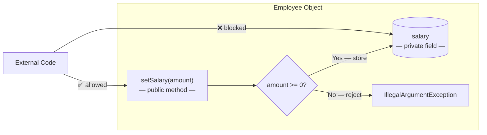

---

## Why Encapsulation Matters

- **Data protection** — fields can’t be corrupted from outside
- **Single source of truth** — validation rules live in one place (the setter)
- **Safe to change** — internal implementation can be updated without breaking callers
- **Predictable behavior** — an encapsulated object is always in a valid state

---


# Object Relationships

We have built a well-structured, encapsulated `Employee` class.
Now the next question is: **how do objects connect to each other?**

In the real world, objects don't exist in isolation. An employee uses a laptop, belongs to a company, and has a contract. In OOP, we model these connections as **object relationships**.

There are three types — each with a different level of dependency:

| Relationship | Keyword | Strength | Example |
|---|---|---|---|
| **Association** | *uses* | Weakest — independent | Employee uses a Laptop |
| **Aggregation** | *has-a* | Medium — parts survive without whole | Company has Employees |
| **Composition** | *owns* | Strongest — part cannot exist alone | Employee owns a WorkContract |

---

## Association — "uses" relationship

Association is the most basic connection between two objects.
They are **aware of each other** and can interact — but neither creates nor owns the other.
If one is removed, the other still exists independently.

Think of an **Employee** and a **Laptop**:
- IT assigns a laptop to an employee to work with
- The laptop is owned by the company — not by the employee
- When the employee leaves, the laptop is reassigned to someone else
- If the laptop breaks, the employee still works on another machine

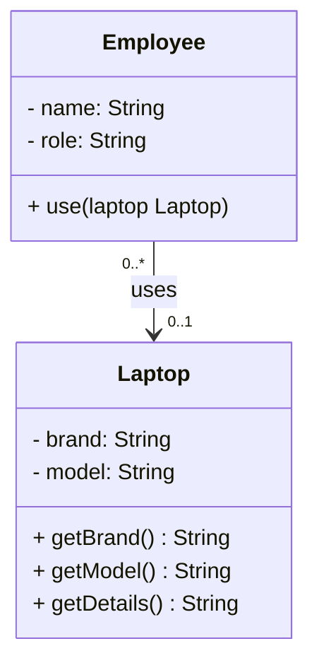

> **Notation:** A plain arrow `──►` means *uses*. No diamond — the two objects are simply aware of each other.

```java
// ASSOCIATION partner class
// Laptop exists independently — it is not created or owned by Employee.
// It is passed into Employee.use() as a parameter and used temporarily.
// When the method call ends, the connection between Employee and Laptop is gone.
public class Laptop {
    private String brand;
    private String model;

    public Laptop(String brand, String model) {
        this.brand = brand;
        this.model = model;
    }

    public String getBrand() { return brand; }
    public String getModel() { return model; }

    public String getDetails() {
        return brand + " " + model;
    }
}
```

The `use()` method is added to `Employee` — the laptop is passed in as a parameter, not stored as a field:

```java

public class Employee {

    // ── FIELDS ────────────────────────────────────────────────────────
    // private = only this class can read or write these directly
    // No outside code can touch them — access goes through methods only
    private String     name;
    private String     role;
    private Department department;
    private double     salary;

    // ── CONSTRUCTOR ───────────────────────────────────────────────────
    // Routes through setters so validation runs even at creation time
    // An Employee can never be created with invalid data
    public Employee(String name, String role, Department department, double salary) {
        setName(name);
        setRole(role);
        setDepartment(department);
        setSalary(salary);
    }

    // ── GETTERS ───────────────────────────────────────────────────────
    // Allow outside code to READ a field — but not change it directly
    public String     getName()       { return name; }
    public String     getRole()       { return role; }
    public Department getDepartment() { return department; }
    public double     getSalary()     { return salary; }

    // ── SETTERS ───────────────────────────────────────────────────────
    // Allow outside code to CHANGE a field — but only after validation
    // Invalid values are rejected with a clear error message

    public void setName(String name) {
        if (name == null || name.isBlank())
            throw new IllegalArgumentException("Name cannot be empty.");
        this.name = name;
    }

    public void setRole(String role) {
        if (role == null || role.isBlank())
            throw new IllegalArgumentException("Role cannot be empty.");
        this.role = role;
    }

    public void setDepartment(Department department) {
        if (department == null)
            throw new IllegalArgumentException("Department cannot be null.");
        this.department = department;
    }

    public void setSalary(double salary) {
        if (salary < 0)
            throw new IllegalArgumentException("Salary cannot be negative.");
        this.salary = salary;
    }

    // ── BEHAVIOUR METHODS ─────────────────────────────────────────────
    // Business logic that works with the private fields safely

    // Adds to salary — validates that the raise is a positive amount
    public void raiseSalary(double amount) {
        if (amount <= 0)
            throw new IllegalArgumentException("Raise amount must be positive.");
        this.salary += amount;
        IO.println(name + "'s new salary: " + salary);
    }

    public void introduce() {
        IO.println("Hi, I'm " + name + ", " + role + " in " + department + ".");
    }

    public void work() {
        IO.println(name + " is working on their tasks.");
    }

    // Prints a summary line — reads private fields through the object itself
    public void displayInfo() {
        IO.println(name + " | " + role + " | " + department + " | " + salary);
    }

    // ASSOCIATION method — Laptop is passed as a parameter, not stored as a field.
    // The connection exists only during this method call.
    // Employee uses the Laptop temporarily — no ownership, no permanent bond.
    public void use(Laptop laptop) {
        if (laptop == null)
            throw new IllegalArgumentException("Laptop cannot be null.");
        IO.println(getName() + " is using " + laptop.getDetails());
    }
}
```

```java
public class App {
    
    void main() {
        Laptop   laptop = new Laptop("Dell", "XPS 15");
        Employee frida  = new Employee("Frida", "Developer", Department.IT, 75000);
    
        frida.use(laptop);
        // Frida is using Dell XPS 15
    
        // The laptop still exists after Frida leaves — they are independent.
    }
}
```

> The `Laptop` is passed into the method — `Employee` uses it but does not own it.

---

### Why a Parameter, Not a Field?

You might wonder: why didn't we add `private Laptop laptop` as a field on `Employee`?

Because that would change the meaning of the relationship entirely:

```java
// If Laptop were a field — this is Aggregation, not Association
public class Employee {
    private Laptop laptop;   // Employee "has" a laptop permanently
    
    public void setLaptop(Laptop laptop) {
        this.laptop = laptop;
    }
    
}
```

That would mean: *this employee is permanently bonded to one specific laptop* — which is not true. The laptop belongs to IT, it gets reassigned, and different employees may use it.

By passing it as a **parameter**, we say: *the employee borrows whichever laptop is handed to them at that moment, uses it, and the relationship ends when the method returns.*

| | Field | Parameter |
|---|---|---|
| Relationship lasts | as long as the object lives | only during the method call |
| Object "has" the other | permanently | temporarily |
| Relationship type | Aggregation or Composition | Association |

> **Rule:** If the connection is **permanent** → store as a field.
> If the connection is **temporary** → pass as a parameter.

---

## Aggregation — "has-a" relationship (weak)

Aggregation means one object **holds a collection** of other objects.
The contained objects are **independent** — they can exist on their own, even without the container.

Think of a **Company** and its **Employees**:
- A company holds a list of employees
- If the company closes, the employees still exist — they can work elsewhere
- The employees were created outside the company and passed in

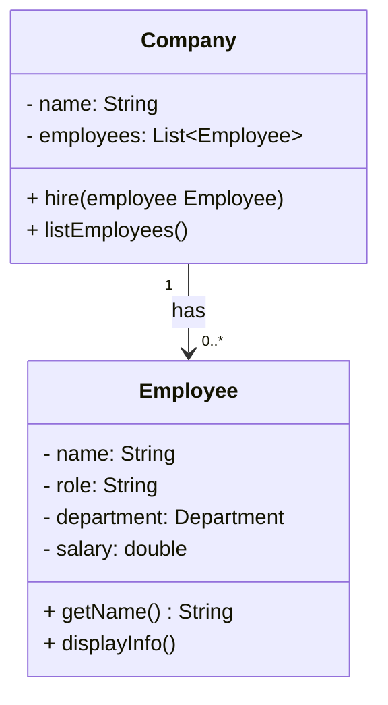

> **Notation:** Aggregation is shown with an open diamond `◇──` (`o--`). Multiplicity labels are added here using `-->` because Mermaid does not support multiplicity on `o--`. In a strict UML tool the arrow would show a hollow diamond. The meaning is the same: parts survive without the whole.

```java
import java.util.ArrayList;
import java.util.List;

// AGGREGATION — "has-a" (weak)
// Company holds a collection of Employee objects, but does NOT create them.
// Employees are built outside and passed in via hire().
// If Company is removed, the Employee objects still exist — they are independent.
public class Company {
    private String         name;
    private List<Employee> employees;

    public Company(String name) {
        this.name      = name;
        this.employees = new ArrayList<>();
    }

    public String getName() { return name; }

    // Employees are created outside and passed in — Company holds a reference, not ownership
    public void hire(Employee employee) {
        employees.add(employee);
       IO.println(employee.getName() + " hired at " + name);
    }

    public void listEmployees() {
       IO.println("\nEmployees at " + name + ":");
        for (Employee employee : employees) {
            employee.displayInfo();
        }
    }
}
```

```java
public class App {
    
    void main() {
        Employee anna = new Employee("Anna", "Developer", Department.IT, 75000);
        Employee lena = new Employee("Lena", "Designer", Department.MARKETING, 65000);
        Employee klara = new Employee("Klara", "Analyst", Department.FINANCE, 70000);

        Company techCorp = new Company("TechCorp");
        techCorp.hire(anna);
        techCorp.hire(lena);
        techCorp.hire(klara);
        techCorp.listEmployees();
        // Employees at TechCorp:
        // Anna | Developer | IT | 75000.0
        // Lena | Designer | MARKETING | 65000.0
        // Klara | Analyst | FINANCE | 70000.0

        // The employees exist independently — removing TechCorp does not remove them.
    }
    
}

```

> `Company` holds **references** to employees — it does not create or own them.

---

### Why a Field, Not a Parameter?

Here the `List<Employee>` is stored as a **field** — not passed as a parameter. This is what makes it Aggregation instead of Association.

```java
// If we only passed Employee to a one-off method — that would be Association
public void process(Employee employee) { }   // temporary, no storage

// Storing employees as a field — this is Aggregation
private List<Employee> employees;   // permanent collection, lives with the Company
```

The `Company` needs to **remember** its employees across many method calls. It holds them persistently until the company itself is gone.

But notice — the employees are **created outside** and passed in via `hire()`. The `Company` never calls `new Employee(...)`. This is what separates Aggregation from Composition:

| | Aggregation | Composition |
|---|---|---|
| Objects stored as | field (collection) | field (single owned object) |
| Objects created | **outside**, passed in | **inside** the parent constructor |
| Can parts exist alone? | Yes — employees survive without Company | No — part is destroyed with parent |

> **Rule:** Aggregation = *I hold you, but you existed before me and you'll survive without me.*

---

## Composition — "owns" relationship (strong)

Composition is the strongest relationship — one object **creates and fully owns** another.
The child object **cannot exist** without the parent. If the parent is destroyed, the child goes with it.

Think of an **Employee** and their **WorkContract**:
- Every employee has exactly one work contract
- The contract is created when the employee is hired
- The contract belongs only to that employee — it has no meaning on its own
- If the employee record is deleted, the contract goes with it

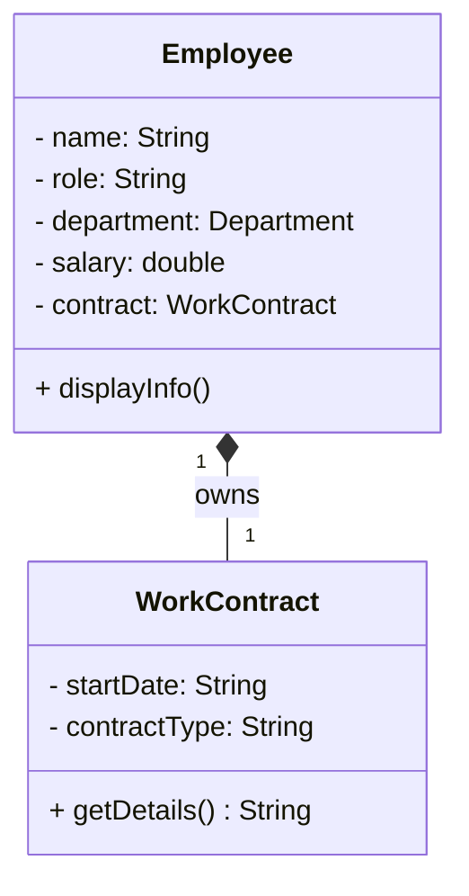

> **Notation:** A filled diamond `◆──` on the owner side means *owns (strong)*. The filled diamond signals the part cannot exist without the whole.

```java
// COMPOSITION — "owns" (strong)
// WorkContract cannot exist on its own — it is always created inside Employee's constructor.
// The constructor is package-private: nothing outside this package can create a WorkContract directly.
// When an Employee object is gone, its WorkContract is gone with it.
public class WorkContract {
    private String startDate;
    private String contractType;

    // Package-private — only Employee (same package) can call this
    WorkContract(String startDate, String contractType) {
        this.startDate    = startDate;
        this.contractType = contractType;
    }

    public String getDetails() {
        return contractType + " contract (started: " + startDate + ")";
    }
}
```

`Employee` is extended with an extra field and an extra constructor that creates the `WorkContract` internally:

```java
// Extra constructor — for employees with a work contract
public Employee(String name, String role, Department department, double salary,
                String startDate, String contractType) {
    setName(name);
    setRole(role);
    setDepartment(department);
    setSalary(salary);
    this.contract = new WorkContract(startDate, contractType);  // created inside Employee
}

// Updated displayInfo to include contract details
public void displayInfo() {
    String info = getName() + " | " + getRole() + " | " + getDepartment() + " | " + getSalary();
    if (contract != null) info += " | " + contract.getDetails();
   IO.println(info);
}
```

```java
public class Employee {

    // ── FIELDS ────────────────────────────────────────────────────────
    private String       name;
    private String       role;
    private Department   department;
    private double       salary;
    private WorkContract contract;   // owned by Employee — created internally

    // ── CONSTRUCTORS ──────────────────────────────────────────────────

    // Standard constructor — no contract
    public Employee(String name, String role, Department department, double salary) {
        setName(name);
        setRole(role);
        setDepartment(department);
        setSalary(salary);
    }

    // Extended constructor — creates WorkContract internally (Composition)
    public Employee(String name, String role, Department department, double salary,
                    String startDate, String contractType) {
        setName(name);
        setRole(role);
        setDepartment(department);
        setSalary(salary);
        this.contract = new WorkContract(startDate, contractType);  // created inside Employee
    }

    // ── GETTERS ───────────────────────────────────────────────────────
    public String       getName()       { return name; }
    public String       getRole()       { return role; }
    public Department   getDepartment() { return department; }
    public double       getSalary()     { return salary; }
    public WorkContract getContract()   { return contract; }

    // ── SETTERS ───────────────────────────────────────────────────────
    public void setName(String name) {
        if (name == null || name.isBlank())
            throw new IllegalArgumentException("Name cannot be empty.");
        this.name = name;
    }

    public void setRole(String role) {
        if (role == null || role.isBlank())
            throw new IllegalArgumentException("Role cannot be empty.");
        this.role = role;
    }

    public void setDepartment(Department department) {
        if (department == null)
            throw new IllegalArgumentException("Department cannot be null.");
        this.department = department;
    }

    public void setSalary(double salary) {
        if (salary < 0)
            throw new IllegalArgumentException("Salary cannot be negative.");
        this.salary = salary;
    }

    // ── BEHAVIOUR METHODS ─────────────────────────────────────────────
    public void raiseSalary(double amount) {
        if (amount <= 0)
            throw new IllegalArgumentException("Raise amount must be positive.");
        this.salary += amount;
        IO.println(getName() + "'s new salary: " + getSalary());
    }

    public void introduce() {
        IO.println("Hi, I'm " + getName() + ", " + getRole() + " in " + getDepartment() + ".");
    }

    public void work() {
        IO.println(getName() + " is working on their tasks.");
    }

    // Prints summary — includes contract details if present
    public void displayInfo() {
        String info = getName() + " | " + getRole() + " | " + getDepartment() + " | " + getSalary();
        if (contract != null) info += " | " + contract.getDetails();
        IO.println(info);
    }

    // Association — Laptop is passed in, Employee uses it but does not own it
    public void use(Laptop laptop) {
        IO.println(getName() + " is using " + laptop.getDetails());
    }
}
```

```java
public class App {
    
    void main() {
        Employee johan = new Employee("Johan", "Developer", Department.IT,        80000, "2023-01-15", "Full-Time");
        Employee sofia = new Employee("Sofia", "Designer",  Department.MARKETING, 60000, "2023-03-01", "Part-Time");

        johan.displayInfo();  // Johan | Developer | IT | 80000.0 | Full-Time contract (started: 2023-01-15)
        sofia.displayInfo();  // Sofia | Designer | MARKETING | 60000.0 | Part-Time contract (started: 2023-03-01)

        // WorkContract cannot be created outside Employee — it has no public constructor.
        // new WorkContract(...);  // compile error — constructor is package-private
    }
    
}

```

> The `WorkContract` is created **inside** the `Employee` constructor — it cannot exist on its own.

---

### Why a Field Created Inside the Constructor?

`WorkContract` is stored as a **field** — just like in Aggregation. But there is one critical difference: it is created **inside** `Employee`, not passed in from outside.

**Aggregation** — object created outside, passed in:
```java
public class App {
    
    void main() {
        Company  company = new Company("TechCorp");
        Employee anna    = new Employee("Anna", "Developer", Department.IT, 75000);
        company.hire(anna);   // anna existed before the company hired her
    }

}

```

**Composition** — object created inside the constructor:
```java
public Employee(String name, String role, Department department, double salary,
                String startDate, String contractType) {
    setName(name);
    setRole(role);
    setDepartment(department);
    setSalary(salary);
    this.contract = new WorkContract(startDate, contractType);  // born here, dies here
}
```

The `WorkContract` has no life outside of `Employee`. It is created with it, lives with it, and is gone when the `Employee` object is gone. This is why the `WorkContract` constructor is package-private — nothing outside the package can create one directly.

| | Association | Aggregation | Composition |
|---|---|---|---|
| Stored as field? | No — parameter only | Yes — collection field | Yes — single field |
| Created by parent? | No | No — passed in | Yes — inside constructor |
| Can exist alone? | Yes | Yes | No |
| Strength | Weakest | Medium | Strongest |

> **Rule:** Composition = *I created you, I own you, and you cannot exist without me.*

---

# Inheritance

## What Is Inheritance?

In real life, children inherit traits from their parents — eye color, height, maybe a talent for music.
They don't start from zero. They get everything from the parent, and then add their own unique qualities on top.

**Inheritance in OOP works the same way.**

A child class (subclass) automatically gets all the fields and methods of its parent class (superclass).
It can then add new behavior, or change existing behavior, without touching the parent.

In the Employee Management System, `Employee` holds everything every employee has — `name`, `role`, `department`, `salary`, and behavior like `raiseSalary()` or `work()`. A `Manager` and a `Developer` are both employees, so instead of rewriting all of that, they simply **inherit** it from `Employee`. `Manager` then adds its own fields like `teamSize`, and `Developer` adds `programmingLanguage` — each only defines what makes it *different*, while everything they share stays in one place.

> **The "is-a" rule:** If you can say "A is a B", inheritance is the right tool.
> - A `Manager` **is an** `Employee` ✅
> - A `Developer` **is an** `Employee` ✅
> - A `Company` **is an** `Employee` ❌ — wrong relationship, use composition instead

---

## The Problem — Duplicate Code

Without inheritance, `Manager` and `Developer` would need to copy everything from `Employee`:

```java
public class Manager {
    private String     name;        // same as Employee
    private String     role;        // same as Employee
    private Department department;  // same as Employee
    private double     salary;      // same as Employee
    private int        teamSize;          // Manager-specific
    private int        yearsOfExperience; // Manager-specific

    // all the same getters, setters, raiseSalary(), work()... copied again
}
```

```java
public class Developer {
    private String     name;                // same as Employee
    private String     role;                // same as Employee
    private Department department;          // same as Employee
    private double     salary;              // same as Employee
    private String     programmingLanguage; // Developer-specific
    private String     specialization;      // Developer-specific

    // all the same getters, setters, raiseSalary(), work()... copied again
}
```

This is fragile. If you fix a bug in `Employee`, you have to remember to fix it in every copy.
Inheritance eliminates the duplication entirely.

---

## The Solution — `extends`

```java
public class Manager extends Employee {
    // Employee's fields and methods are already here — no need to repeat them
    private int teamSize;          // Manager-specific
    private int yearsOfExperience; // Manager-specific
}
```

```java
public class Developer extends Employee {
    // Employee's fields and methods are already here — no need to repeat them
    private String programmingLanguage; // Developer-specific
    private String specialization;      // Developer-specific ("Backend", "Frontend", "Full Stack")
}
```

The keyword `extends` means: *"Start with everything Employee has, then add more."*

---

## Class Diagram

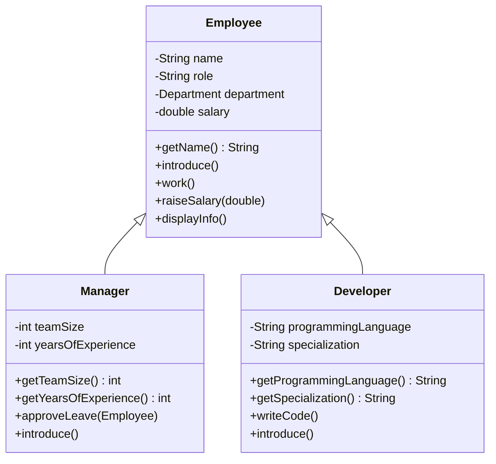

> `Employee <|-- Manager` reads as: Manager **inherits from** Employee (the arrow points to the parent).

---

## Manager — Calling the Parent Constructor with `super`

```java
// Manager IS-AN Employee — inherits name, role, department, salary and all methods
public class Manager extends Employee {

    private int teamSize;          // how many people this manager leads
    private int yearsOfExperience; // total years in the industry

    public Manager(String name, Department department, double salary, int teamSize, int yearsOfExperience) {
        // super() calls Employee's constructor — sets name, role, department, salary
        // role is hardcoded to "Manager" — a Manager is always a Manager
        super(name, "Manager", department, salary);
        this.teamSize          = teamSize;
        this.yearsOfExperience = yearsOfExperience;
    }

    public int getTeamSize()          { return teamSize; }
    public int getYearsOfExperience() { return yearsOfExperience; }

    // Manager-specific behaviour
    public void approveLeave(Employee employee) {
        IO.println(getName() + " approved leave for " + employee.getName());
    }
    
}
```

**Why `super(...)`?**
`Employee`'s fields are `private` — `Manager` cannot set them directly.
`super(...)` calls `Employee`'s constructor, which sets them safely through the setters with validation.
Without `super(...)` as the first line, the code will not compile.

---

## Developer — Adding New Behaviour

```java
// Developer IS-AN Employee — inherits name, role, department, salary and all methods
public class Developer extends Employee {

    private String programmingLanguage; // main language this developer works in
    private String specialization;      // area of focus: "Backend", "Frontend", "Full Stack"

    public Developer(String name, Department department, double salary, String programmingLanguage, String specialization) {
        // super() calls Employee's constructor — role is hardcoded to "Developer"
        super(name, "Developer", department, salary);
        this.programmingLanguage = programmingLanguage;
        this.specialization      = specialization;
    }

    public String getProgrammingLanguage() { return programmingLanguage; }
    public String getSpecialization()      { return specialization; }

    // Developer-specific behaviour
    public void writeCode() {
        IO.println(getName() + " is writing " + programmingLanguage + " code.");
    }
    
}
```

---

## What Gets Inherited?

| | Inherited by Manager/Developer? |
|---|---|
| `private` fields (`name`, `salary`, …) | Yes — but accessed only through getters/setters |
| `protected` fields | Yes — and accessed **directly**, no getters/setters needed |
| `public` methods (`work()`, `raiseSalary()`, …) | Yes — available directly |
| Constructors | No — each class writes its own, calls `super()` |
| `@Override` methods (`introduce()`) | Replaced — the child's version runs instead |

> `Employee`'s fields are `private`, so `Manager` and `Developer` still go through `getName()`, `getSalary()`, etc. — inheritance doesn't bypass encapsulation.
> If a field were `protected` instead, subclasses could reach it directly (e.g. `salary` instead of `getSalary()`) — but so could every other class in the same package, so it's a narrower, less common choice than keeping fields `private` with `public` getters/setters.

---

## `@Override` — Replacing a Parent Method

Both `Manager` and `Developer` override `introduce()`.
The `@Override` annotation tells the compiler: *"I am intentionally replacing the parent's version."*

```java
// Employee's version
public void introduce() {
    IO.println("Hi, I'm " + getName() + ", " + getRole() + " in " + getDepartment() + ".");
}

// Manager's version — @Override replaces it
@Override
public void introduce() {
    IO.println("Hi, I'm " + getName() + ", Manager of a team of "
            + teamSize + " in " + getDepartment()
            + " with " + yearsOfExperience + " years of experience.");
}
```

If you don't override a method, the parent's version is used automatically.
`work()`, `raiseSalary()`, and `displayInfo()` are not overridden — `Employee`'s versions run for both.

---

```java
public class App {

    void main() {
        Manager   lars  = new Manager("Lars",   Department.IT, 90000, 5, 12);
        Developer sofia = new Developer("Sofia", Department.IT, 75000, "Java", "Backend");

        lars.introduce();          
        sofia.introduce();         

        lars.work();               
        sofia.writeCode();         

        lars.approveLeave(sofia);  

        sofia.raiseSalary(5000);   
        lars.displayInfo();        
    }


}
```

---

## Key Rules

| Rule | Why |
|---|---|
| Use `extends` to inherit | `class Manager extends Employee` |
| Always call `super(...)` first | Parent fields are `private` — only parent's constructor can set them |
| Use `@Override` when replacing a method | Compiler catches typos; makes the intent clear |
| Only one parent allowed | Java does not support multiple inheritance of classes |
| Use "is-a" to decide | If "Manager is an Employee" is true — inherit. If not — use composition. |

---

# Polymorphism — One Action, Many Forms

## What Is Polymorphism?

**Polymorphism** means *many forms*. In Java, the same method call can produce different behavior depending on which object is behind it.

Think about **paying at checkout** — you say *"pay"*, but the result depends on the method:
- **Cash** → count and hand over bills
- **Card** → tap the terminal
- **Swish** → scan a QR code

Same instruction — completely different behavior depending on which object receives it. That is polymorphism.

Java gives us two forms of polymorphism:

| Form | How | When it's resolved |
|---|---|---|
| **Overloading** | Same method name, different parameters | Compile time |
| **Overriding** | Subclass replaces a parent method | Runtime |

---

## Method Overloading

**Overloading** means writing multiple methods with the **same name** but **different parameters** in the same class.
Java picks the right version based on the arguments you pass — at compile time.

```java
public class Employee {

    // existing code ...
    
    // ── EXISTING ──────────────────────────────────────────────────────────────
    public void raiseSalary(double amount) {
        if (amount <= 0)
            throw new IllegalArgumentException("Raise amount must be positive.");
        this.salary += amount;
        IO.println(getName() + "'s new salary: " + getSalary());
    }

    // ── ADD THIS — overloaded version, same name, different parameters ────────
    public void raiseSalary(double amount, String reason) {
        if (amount <= 0)
            throw new IllegalArgumentException("Raise amount must be positive.");
        if (reason == null || reason.isBlank())
            throw new IllegalArgumentException("Reason must not be empty.");
        this.salary += amount;
        IO.println(getName() + "'s salary raised by " + amount + " (" + reason + "). New salary: " + getSalary());
    }

    // existing code ...
    
}
```

```java
public class App {

    void main() {
        Employee sofia = new Employee("Sofia", "Developer", Department.IT, 75000);

        sofia.raiseSalary(5000);                        // calls first version
        sofia.raiseSalary(3000, "annual performance");  // calls second version
    }

}
```

```text
Sofia's new salary: 80000.0
Sofia's salary raised by 3000.0 (annual performance). New salary: 83000.0
```

---

## Method Overriding

**Overriding** means a subclass provides its **own version** of a method that already exists in the parent.
The subclass method has the **exact same name and parameters** — it replaces the parent's version.

```java
// Employee's version — generic
public void introduce() {
    IO.println("Hi, I'm " + getName() + ", " + getRole() + " in " + getDepartment() + ".");
}
```

```java
// Manager's version — @Override replaces Employee's
@Override
public void introduce() {
    IO.println("Hi, I'm " + getName() + ", Manager of a team of "
            + teamSize + " in " + getDepartment()
            + " with " + yearsOfExperience + " years of experience.");
}

// Developer's version — @Override replaces Employee's
@Override
public void introduce() {
    IO.println("Hi, I'm " + getName() + ", a " + specialization
            + " Developer (" + programmingLanguage + ") in " + getDepartment() + ".");
}
```

```java
void main() {
    Manager   lars  = new Manager("Lars",   Department.IT, 90000, 5, 12);
    Developer sofia = new Developer("Sofia", Department.IT, 75000, "Java", "Backend");

    lars.introduce();   // Manager's version  → "Hi, I'm Lars, Manager of a team of 5..."
    sofia.introduce();  // Developer's version → "Hi, I'm Sofia, a Backend Developer (Java) in IT."
}
```

> `@Override` tells the compiler: *"I am intentionally replacing the parent's version."*
> If you mistype the method name, the compiler catches it immediately — without `@Override`, it would silently create a new unrelated method.

| | Overloading | Overriding |
|---|---|---|
| Same name? | Yes | Yes |
| Same parameters? | No — different | Yes — identical |
| Where? | Same class | Subclass replaces parent |
| Resolved | Compile time | Runtime |
| Annotation | None | `@Override` |

---

## Upcasting — One Type, Many Forms

Because `Manager` and `Developer` both extend `Employee`, a variable of type `Employee` can hold either:

```java
Employee e1 = new Manager("Lars",    Department.IT, 90000, 5, 12);
Employee e2 = new Developer("Sofia", Department.IT, 75000, "Java", "Backend");
Employee e3 = new Developer("Erik",  Department.IT, 70000, "Python", "Full Stack");
```

All three are declared as `Employee` — but each one remembers its actual type.
When you call `introduce()`, Java uses the **actual type**, not the declared type:

```text
e1.introduce(); // → Manager's introduce()   "Hi, I'm Lars, Manager of a team of 5..."
e2.introduce(); // → Developer's introduce() "Hi, I'm Sofia, a Backend Developer (Java) in IT."
e3.introduce(); // → Developer's introduce() "Hi, I'm Erik, a Full Stack Developer (Python) in IT."
```

This is called **upcasting** — treating a subtype as its parent type. The override is resolved at runtime — this is what makes polymorphism powerful.

> `e1.approveLeave(...)` is a **compile error** — the declared type is `Employee`, which has no `approveLeave()`.
> Java sees only what `Employee` declares at compile time. Subtype-specific methods are hidden until you cast down.

---

## A Mixed List

Because `Manager` and `Developer` are both `Employee`, you can put all of them in a single `List<Employee>` and loop once:

```java
void main() {
    List<Employee> team = new ArrayList<>();
    team.add(new Manager("Lars",    Department.IT, 90000, 5, 12));
    team.add(new Developer("Sofia", Department.IT, 75000, "Java", "Backend"));
    team.add(new Developer("Erik",  Department.IT, 70000, "Python", "Full Stack"));

    for (Employee e : team) {
        e.introduce();  // Java calls each object's OWN version automatically
    }
}
```

```text
Hi, I'm Lars, Manager of a team of 5 in IT with 12 years of experience.
Hi, I'm Sofia, a Backend Developer (Java) in IT.
Hi, I'm Erik, a Full Stack Developer (Python) in IT.
```

One loop — three different outputs. No `if`, no type check. Java resolves the right `introduce()` at runtime based on the actual object. That is overriding and upcasting working together.

---

## `instanceof` — When You Need the Actual Type

`@Override` handles behavior that every subtype shares. But sometimes you need data that only one subtype has — `teamSize` exists only on `Manager`, `specialization` exists only on `Developer`. The parent `Employee` does not expose them.

That is when you use `instanceof`.

**Option 1 — `if / else if` with pattern matching (Java 16+)**

```java

import java.util.ArrayList;
import java.util.List;

public class App {

    void main() {
        List<Employee> team = new ArrayList<>();
        team.add(new Manager("Lars",    Department.IT, 90000, 5, 12));
        team.add(new Developer("Sofia", Department.IT, 75000, "Java", "Backend"));
        team.add(new Developer("Erik",  Department.IT, 70000, "Python", "Full Stack"));

        for (Employee e : team) {
            if (e instanceof Manager m) {
                // m is already cast to Manager — getTeamSize() is available
                IO.println(m.getName() + " leads a team of " + m.getTeamSize());
            } else if (e instanceof Developer d) {
                // d is already cast to Developer — getSpecialization() is available
                IO.println(d.getName() + " specializes in " + d.getSpecialization());
            }
        }
    }

}
```

**Option 2 — `switch` with pattern matching (Java 21+)**

The same logic with a `switch` — cleaner when there are more than two types:

```java
import java.util.ArrayList;
import java.util.List;

public class App {

    void main() {
        List<Employee> team = new ArrayList<>();
        team.add(new Manager("Lars",    Department.IT, 90000, 5, 12));
        team.add(new Developer("Sofia", Department.IT, 75000, "Java", "Backend"));
        team.add(new Developer("Erik",  Department.IT, 70000, "Python", "Full Stack"));

        for (Employee e : team) {
            switch (e) {
                case Manager   m -> IO.println(m.getName() + " leads a team of " + m.getTeamSize());
                case Developer d -> IO.println(d.getName() + " specializes in " + d.getSpecialization());
                default          -> IO.println(e.getName() + " is a general employee.");
            }
        }
    }

}
```

Both produce the same output:
```text
Lars leads a team of 5.
Sofia specializes in Backend.
Erik specializes in Full Stack.
```

---

# Abstraction — Hiding Complexity

## What Is Abstraction?

Abstraction means showing **what** something does — not **how** it does it.

Think about **driving a car**:
- You press the accelerator → the car moves
- You don't need to know about pistons, fuel injection, or the gearbox
- The complexity is hidden — you only see what you need to interact with

Or think about a **TV remote**:
- You press "volume up" → the sound gets louder
- You have no idea what signal is sent, what chip processes it, or how the speaker is adjusted
- You just use the button. The rest is hidden.

> **Abstraction = expose the interface, hide the implementation.**

Java gives us two tools for abstraction:

| Tool | Purpose |
|---|---|
| **Abstract class** | A template that cannot be created directly — defines shared structure and forces subclasses to fill in the gaps |
| **Interface** | A pure contract — defines what a class must be able to do, with no implementation at all |

---

## Abstract Class

An **abstract class** is marked with the `abstract` keyword.
It **cannot be instantiated** — you can never do `new Employee()`.
It exists only to be extended by concrete subclasses.

Think about our `Employee` — in real life, you never just hire an "employee". You hire a **Manager** or a **Developer**. Making `Employee` abstract enforces this in code: every employee must be a specific role.

It can contain:
- **Abstract methods** — declared but with no body; every subclass must implement them
- **Concrete methods** — fully implemented; shared by all subclasses

```java
// new Employee(...) → compile error — Employee is now abstract
public abstract class Employee {

    private String     name;
    private String     role;
    private Department department;
    private double     salary;

    public Employee(String name, String role, Department department, double salary) {
        setName(name); setRole(role); setDepartment(department); setSalary(salary);
    }

    // ... getters, setters, raiseSalary(), introduce(), displayInfo() stay the same ...

    // abstract — no body — every role welcomes a new team member differently
    public abstract void onboard(Employee newEmployee);
}
```

Every subclass **must** implement `onboard()` — otherwise it will not compile:

```java
// In Manager:
@Override
public void onboard(Employee newEmployee) {
    IO.println(getName() + " is assigning tasks and setting goals for " + newEmployee.getName() + ".");
}

// In Developer:
@Override
public void onboard(Employee newEmployee) {
    IO.println(getName() + " is doing pair programming with " + newEmployee.getName() + ".");
}
```

Demo — a new hire joins the team and every existing employee onboards them in their own way:

```java
void main() {
    Employee johan = new Developer("Johan", Department.IT, 55000, "Java", "Frontend"); // the new hire

    List<Employee> team = new ArrayList<>();
    team.add(new Manager("Lars",    Department.IT, 90000, 5, 12));
    team.add(new Developer("Sofia", Department.IT, 75000, "Java", "Backend"));
    team.add(new Developer("Erik",  Department.IT, 70000, "Python", "Full Stack"));

    for (Employee e : team) {
        e.onboard(johan); // each role onboards the new hire differently
    }
}
```

Output:
```text
Lars is assigning tasks and setting goals for Johan.
Sofia is doing pair programming with Johan.
Erik is doing pair programming with Johan.
```

`onboard()` is called on an `Employee` reference — the caller never knows or cares how each role handles it. That is abstraction.

---

## Interface

An **interface** is a pure contract — it lists what a class must be able to do, with zero implementation.

- All methods are implicitly `public abstract`
- A class uses `implements` (not `extends`) to sign the contract
- A class can implement **multiple** interfaces — unlike classes, where only one parent is allowed

`EmployeeDAO` is a perfect real-world example. It defines the operations any employee storage must support — without saying anything about *how* the data is stored:

```java
import java.util.List;

public interface EmployeeDAO {
    void           add(Employee employee);   // no body — the implementation decides how
    List<Employee> findAll();                // no body — the implementation decides how
    Employee       findByName(String name);  // no body — the implementation decides how
    void           remove(Employee employee);// no body — the implementation decides how
}
```

`EmployeeDAOImpl` signs the contract and provides the actual logic using a `List`:

```java
import java.util.ArrayList;
import java.util.List;

public class EmployeeDAOImpl implements EmployeeDAO {

    private List<Employee> employees = new ArrayList<>();

    // private — internal helper, not part of the interface, invisible to callers
    private boolean exists(String name) {
        return findByName(name) != null;
    }

    @Override
    public void add(Employee employee) {
        if (exists(employee.getName())) {
            IO.println(employee.getName() + " already exists in the system.");
            return;
        }
        employees.add(employee);
        IO.println(employee.getName() + " added to the system.");
    }

    @Override
    public List<Employee> findAll() {
        return employees;
    }

    @Override
    public Employee findByName(String name) {
        for (Employee e : employees) {
            if (e.getName().equalsIgnoreCase(name)) return e;
        }
        return null;
    }

    @Override
    public void remove(Employee employee) {
        employees.remove(employee);
        IO.println(employee.getName() + " removed from the system.");
    }
}
```

The caller only ever talks to `EmployeeDAO` — it never knows or cares that a `List` is being used:

```java
public class App {

    void main() {
        EmployeeDAO dao = new EmployeeDAOImpl(); // swap the implementation without touching this line

        dao.add(new Manager("Lars",    Department.IT, 90000, 5, 12));
        dao.add(new Developer("Sofia", Department.IT, 75000, "Java", "Backend"));
        dao.add(new Developer("Erik",  Department.IT, 70000, "Python", "Full Stack"));

        IO.println("-----------------------");
        Employee found = dao.findByName("Lars");
        if (found != null) found.introduce();
        IO.println("-----------------------");

        for (Employee e : dao.findAll()) {
            e.displayInfo();
        }
        IO.println("-----------------------");

        dao.remove(found);

        IO.println("-----------------------");
        for (Employee e : dao.findAll()) {
            e.displayInfo();
        }
    }

}
```

Output:
```text
Lars added to the system.
Sofia added to the system.
Erik added to the system.
Hi, I'm Lars, Manager of a team of 5 in IT with 12 years of experience.
Lars | Manager | IT | 90000.0
Sofia | Developer | IT | 75000.0
Erik | Developer | IT | 70000.0
Lars removed from the system.
```

> Tomorrow you could write `EmployeeDBImpl implements EmployeeDAO` backed by a real database — and `main()` would not change a single line.

---

## Class Diagram

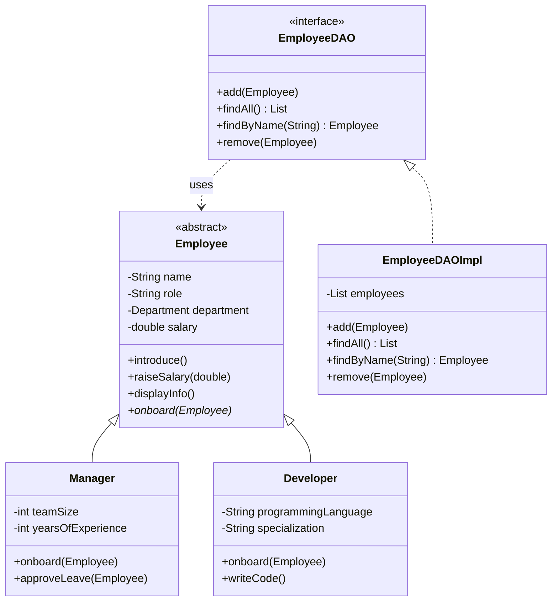

> `<|--` = extends (inherits from) · `<|..` = implements (signs the contract) · `..>` = dependency (uses in method signatures) · `o--` = aggregation (holds a collection) · `*` = abstract method

---

## Abstract Class vs Interface

| | Abstract Class | Interface |
|---|---|---|
| Keyword | `extends` | `implements` |
| Can have fields? | Yes | No (only constants) |
| Can have concrete methods? | Yes | Yes (`default` methods, Java 8+) |
| Multiple allowed? | No — one parent only | Yes — a class can implement many |
| Use when | Sharing code between closely related classes | Defining a capability any class can have |

**Simple rule:**
- "Is-a" with shared code → **abstract class** (`Circle` is a `Shape`)
- "Can-do" capability → **interface** (`Manager` can be `Payable`)

---

## Key Rules

| Rule | Why |
|---|---|
| Abstract class cannot be instantiated | It is a template — always extend it |
| Abstract method has no body | The subclass decides the "how" |
| Interface defines a contract | Any class can implement it, regardless of its parent |
| A class can implement many interfaces | But can only extend one class |
| Prefer interfaces for capabilities | `Payable`, `Printable`, `Comparable` — things a class *can do* |
